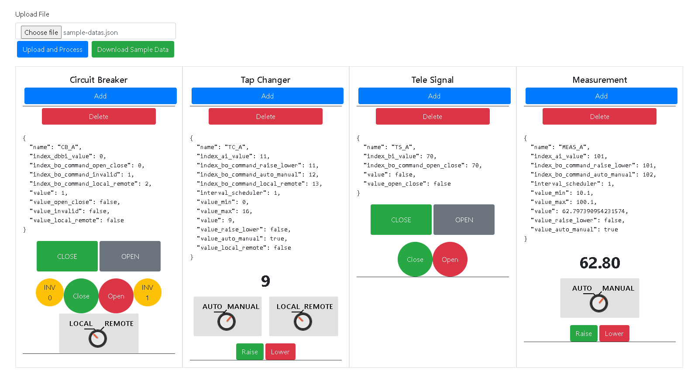
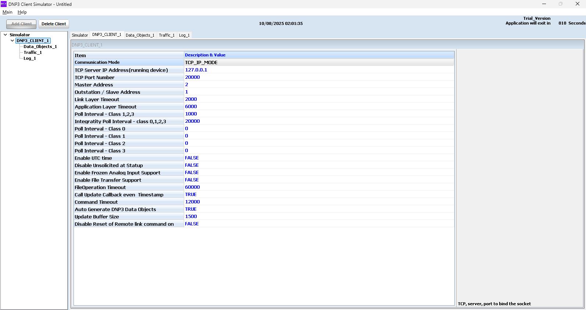
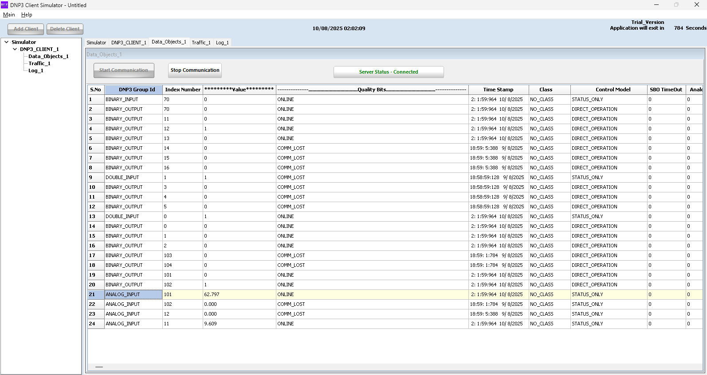

# DNP3 Outstation Simulator

## Overview

This application is a Spring Boot-based DNP3 Outstation Simulator. It is designed to simulate a DNP3 outstation,
allowing for dynamic configuration and interaction with a DNP3 master. The primary purpose of this application is to
provide a flexible and easy-to-use tool for testing DNP3 master implementations and for development and training
purposes.

The application provides a web interface for monitoring and controlling the simulated outstation's data points, such as
measurements, tele-signals, and circuit breakers.



## DNP3 Concepts

For users who may be new to DNP3, here are some basic concepts relevant to this simulator:

- **Master**: The central station in a DNP3 network that initiates communication with outstations. It polls outstations
  for data and sends control commands.
- **Outstation (or Slave)**: A remote device in a DNP3 network that responds to requests from a master. It collects data
  from field devices and sends it to the master. This application simulates an outstation.
- **Data Points**: These are the individual pieces of data that are exchanged between the master and outstation. This
  simulator supports the following types of data points:
    - **Analog Input (AI)**: Represents a continuous value, such as a temperature or pressure reading. Used in this
      project for `MeasurementModel` and `TapChangerModel`.
    - **Binary Input (BI)**: Represents a single digital state, such as on/off or open/closed. Used for
      `TeleSignalModel` and `TapChangerModel`.
    - **Double-bit Binary Input (DBBI)**: Represents a state with four possible values (e.g., `00`, `01`, `10`, `11`),
      often used for devices with intermediate states, like a circuit breaker. Used for `CircuitBreakerModel`.
    - **Binary Output (BO)**: Represents a command from the master to the outstation to change a digital state, such as
      opening or closing a relay. These are often referred to as "Controls" or "Commands".

## Dependencies

- Java 21
- Apache Maven
- Spring Boot
- DNP3 library (`io.stepfunc:dnp3`)

## How to Run

1. **Build the project:**
   ```bash
   ./mvnw clean install
   ```
2. **Run the application:**
   ```bash
   ./mvnw spring-boot:run
   ```
3. Once the application is running, you can access the web interface at `http://localhost:47771`.

## Flow

The application follows this general flow:

1. **Initialization**:
    - When the application starts, the `OutstationRunner` is executed.
    - It reads the DNP3 configuration from `application.properties` using the `Dnp3Properties` class.
    - It creates a `Dnp3ServerOutstationModel` with the configured properties.
    - It calls the `ServerService` to add and start the DNP3 server.

2. **Server Setup**:
    - The `ServerService` creates a TCP server for the outstation.
    - It configures the outstation with the specified master and slave addresses, event buffer sizes, and other
      parameters.
    - It adds the outstation to the server, along with various handlers for DNP3 communication (e.g.,
      `ControlHandlerImpl` for handling commands).
    - The server is bound to the configured host and port, and the outstation is enabled.
    - The outstation instance is registered as a Spring bean for application-wide access.

3. **Data Point Management**:
    - The `DatapointService` is responsible for managing the outstation's data points (e.g., binary inputs, analog
      inputs).
    - When a DNP3 command is received (e.g., a binary output command), the `ControlHandlerImpl` delegates the operation
      to the `DatapointService`.
    - The `DatapointService` identifies the target data point based on its index and performs the requested operation (
      e.g., updating the value of a binary input).
    - It interacts with the `DatabaseService` to update the in-memory database of the outstation.

4. **Web Interface Interaction**:
    - The web interface allows users to interact with the outstation's data points through the various controllers.
    - When a user performs an action in the UI (e.g., clicking a button to open a circuit breaker), an HTTP request is
      sent to the corresponding controller.
    - The controller calls the appropriate service (e.g., `CircuitBreakerService`) to handle the request.
    - The service then interacts with the `DatapointService` or `DatabaseService` to update the outstation's state.

## Configuration

The application can be configured by modifying the `src/main/resources/application.properties` file. The following
properties are available for configuring the DNP3 outstation:

| Property                                | Description                                      | Default Value  |
|-----------------------------------------|--------------------------------------------------|----------------|
| `app.dnp3.outstation-id`                | The ID of the outstation.                        | `1`            |
| `app.dnp3.outstation-name`              | The name of the outstation.                      | `OUTSTATION_A` |
| `app.dnp3.outstation-network-interface` | The network interface to use for the outstation. | `eth0`         |
| `app.dnp3.outstation-protocol`          | The protocol to use for the outstation.          | `DNP3`         |
| `app.dnp3.outstation-host`              | The host address of the outstation.              | `0.0.0.0`      |
| `app.dnp3.outstation-port`              | The port of the outstation.                      | `20000`        |
| `app.dnp3.outstation-address`           | The DNP3 address of the outstation.              | `1`            |
| `app.dnp3.master-address`               | The DNP3 address of the master.                  | `2`            |
| `app.dnp3.keep-alive-timeout`           | The keep-alive timeout in seconds.               | `10`           |
| `app.dnp3.num-core-threads`             | The number of core threads for the outstation.   | `2`            |

## Web Interface

The web interface provides a dashboard for monitoring and controlling the DNP3 outstation. The dashboard is divided into
four main components:

- **Circuit Breaker**: Allows you to add, delete, and control circuit breakers. You can toggle the open/close state, set
  an invalid state, and switch between local and remote control.
- **Tap Changer**: Allows you to add, delete, and control tap changers. You can raise or lower the tap position and
  switch between auto and manual control, as well as local and remote control.
- **Tele-Signal**: Allows you to add, delete, and control tele-signals. You can toggle the open/close state of the
  signal.
- **Measurement**: Allows you to add, delete, and control measurements. You can raise or lower the measurement value and
  switch between auto and manual control.

The web interface also provides the ability to upload a JSON file to configure the outstation with a predefined set of
data points. A sample JSON file can be downloaded from the dashboard.

## Project Structure

The project is organized into the following main packages:

- **`config`**: Contains Spring configuration classes, such as `AppConfig` for defining beans and `WebConfig` for
  web-related configuration.
- **`controller`**: Contains Spring MVC controllers that handle HTTP requests from the web interface. Each controller
  corresponds to a specific type of data point (e.g., `CircuitBreakerController`).
- **`model`**: Contains the data models for the application, such as `CircuitBreakerModel`, `MeasurementModel`, etc.
  These classes define the structure of the data points.
- **`properties`**: Contains classes for managing application properties, such as `Dnp3Properties`.
- **`run`**: Contains the `OutstationRunner` class, which is an `ApplicationRunner` that initializes the DNP3 outstation
  on startup.
- **`scheduler`**: Contains scheduling tasks, such as `OutstationScheduler` for periodic operations.
- **`service`**: Contains the business logic of the application. Services like `ServerService`, `DatapointService`, and
  `CircuitBreakerService` handle the core functionality.
- **`service.callback`**: Contains implementations of the DNP3 library's callback interfaces, such as
  `ControlHandlerImpl` for handling commands and `ConnectionStateListenerImpl` for monitoring connection status.
- **`util`**: Contains utility classes for various purposes, such as JSON conversion (`JsonUtil`) and time formatting (
  `TimeUtil`).

## API Endpoints

The application exposes the following REST endpoints for interacting with the outstation simulator:

### Dashboard

- `GET /` or `/dashboard`: Displays the main dashboard.
- `GET /dashboard/get-bean-data`: Retrieves all data points for the outstation.
- `GET /dashboard/download`: Downloads a sample data file (`sample-datas.json`).

### Circuit Breaker

- `GET /circuit-breaker/get-all`: Retrieves all circuit breaker data.
- `GET /circuit-breaker/get-data/{name}`: Retrieves a specific circuit breaker by name.
- `POST /circuit-breaker/add-data`: Adds a new circuit breaker.
- `DELETE /circuit-breaker/delete-data`: Deletes a circuit breaker.
- `POST /circuit-breaker/action-open-close`: Toggles the open/close state of a circuit breaker.
- `POST /circuit-breaker/action-invalid`: Sets a circuit breaker to an invalid state.
- `POST /circuit-breaker/action-local-remote`: Toggles the local/remote control state of a circuit breaker.

### Measurement

- `GET /measurement/get-all`: Retrieves all measurement data.
- `GET /measurement/get-data/{name}`: Retrieves a specific measurement by name.
- `POST /measurement/add-data`: Adds a new measurement.
- `DELETE /measurement/delete-data`: Deletes a measurement.
- `POST /measurement/action-raise-lower`: Raises or lowers the value of a measurement.
- `POST /measurement/action-auto-manual`: Toggles the auto/manual state of a measurement.

### Tap Changer

- `GET /tap-changer/get-all`: Retrieves all tap changer data.
- `GET /tap-changer/get-data/{name}`: Retrieves a specific tap changer by name.
- `POST /tap-changer/add-data`: Adds a new tap changer.
- `DELETE /tap-changer/delete-data`: Deletes a tap changer.
- `POST /tap-changer/action-raise-lower`: Raises or lowers the tap position.
- `POST /tap-changer/action-auto-manual`: Toggles the auto/manual state of a tap changer.
- `POST /tap-changer/action-local-remote`: Toggles the local/remote control state of a tap changer.

### Tele-Signal

- `GET /tele-signal/get-all`: Retrieves all tele-signal data.
- `GET /tele-signal/get-data/{name}`: Retrieves a specific tele-signal by name.
- `POST /tele-signal/add-data`: Adds a new tele-signal.
- `DELETE /tele-signal/delete-data`: Deletes a tele-signal.
- `POST /tele-signal/action-open-close`: Toggles the open/close state of a tele-signal.

## Data Models

The application uses the following data models:

### CircuitBreakerModel

| Field                           | Type    | Description                                              |
|---------------------------------|---------|----------------------------------------------------------|
| `name`                          | String  | The name of the circuit breaker.                         |
| `index_dbbi_value`              | Integer | The index of the double-bit binary input value.          |
| `index_bo_command_open_close`   | Integer | The index of the binary output command for open/close.   |
| `index_bo_command_invalid`      | Integer | The index of the binary output command for invalid.      |
| `index_bo_command_local_remote` | Integer | The index of the binary output command for local/remote. |
| `value`                         | Integer | The current value of the circuit breaker.                |
| `value_open_close`              | Boolean | The open/close state of the circuit breaker.             |
| `value_invalid`                 | Boolean | The invalid state of the circuit breaker.                |
| `value_local_remote`            | Boolean | The local/remote state of the circuit breaker.           |

### MeasurementModel

| Field                          | Type    | Description                                             |
|--------------------------------|---------|---------------------------------------------------------|
| `name`                         | String  | The name of the measurement.                            |
| `index_ai_value`               | Integer | The index of the analog input value.                    |
| `index_bo_command_raise_lower` | Integer | The index of the binary output command for raise/lower. |
| `index_bo_command_auto_manual` | Integer | The index of the binary output command for auto/manual. |
| `interval_scheduler`           | Integer | The interval for the scheduler in seconds.              |
| `value_min`                    | Double  | The minimum value of the measurement.                   |
| `value_max`                    | Double  | The maximum value of the measurement.                   |
| `value`                        | Double  | The current value of the measurement.                   |
| `value_raise_lower`            | Boolean | The raise/lower state of the measurement.               |
| `value_auto_manual`            | Boolean | The auto/manual state of the measurement.               |

### TapChangerModel

| Field                           | Type    | Description                                              |
|---------------------------------|---------|----------------------------------------------------------|
| `name`                          | String  | The name of the tap changer.                             |
| `index_ai_value`                | Integer | The index of the analog input value.                     |
| `index_bo_command_raise_lower`  | Integer | The index of the binary output command for raise/lower.  |
| `index_bo_command_auto_manual`  | Integer | The index of the binary output command for auto/manual.  |
| `index_bo_command_local_remote` | Integer | The index of the binary output command for local/remote. |
| `interval_scheduler`            | Integer | The interval for the scheduler in seconds.               |
| `value_min`                     | Double  | The minimum value of the tap changer.                    |
| `value_max`                     | Double  | The maximum value of the tap changer.                    |
| `value`                         | Integer | The current value of the tap changer.                    |
| `value_raise_lower`             | Boolean | The raise/lower state of the tap changer.                |
| `value_auto_manual`             | Boolean | The auto/manual state of the tap changer.                |
| `value_local_remote`            | Boolean | The local/remote state of the tap changer.               |

### TeleSignalModel

| Field                         | Type    | Description                                            |
|-------------------------------|---------|--------------------------------------------------------|
| `name`                        | String  | The name of the tele-signal.                           |
| `index_bi_value`              | Integer | The index of the binary input value.                   |
| `index_bo_command_open_close` | Integer | The index of the binary output command for open/close. |
| `value`                       | Boolean | The current value of the tele-signal.                  |
| `value_open_close`            | Boolean | The open/close state of the tele-signal.               |

## Connecting with a DNP3 Master Simulator

To connect this outstation simulator with a DNP3 master simulator (e.g., [DNP3 Master Simulator by FreyrSCADA](https://www.freyrscada.com/dnp3-ieee-1815-Client-Simulator.php)), you need to configure the master to communicate with the outstation's IP address and port.

1.  **Get the Outstation's IP Address**:
    The outstation binds to `0.0.0.0` by default, meaning it listens on all available network interfaces. You will need to use the IP address of the machine running the simulator. You can find this using `ipconfig` on Windows or `ifconfig`/`ip addr` on Linux/macOS.

2.  **Configure the Master Simulator**:
    -   **IP Address**: The IP address of the machine running this DNP3 Outstation Simulator.
    -   **Port**: The port configured in `application.properties` (`app.dnp3.outstation-port`), which defaults to `20000`.
    -   **Master Address**: The DNP3 address of your master simulator. This should match the `app.dnp3.master-address` in the `application.properties` file (default is `2`).
    -   **Outstation Address**: The DNP3 address of this outstation simulator. This should match the `app.dnp3.outstation-address` in the `application.properties` file (default is `1`).



Once the master is configured and connected, it can poll the outstation for data and send control commands. You should see the interactions reflected in both the master simulator's logs and this application's web interface.



## Conventional Commit

Do Before Commit:

- Check code convention & file naming
- Remove unused code, imports, or variable
- Check warning
- Add TODO if code isnt finished
- Keep code to clean

### New Feature or Update Feature

```
[new|patch]{file name or feautre name}
-description
```

example:

```
[new]httputil
-method postReq exception cant throws

[patch]httputil
-method postReq exception now can throws
-add method getReq

[new]measure analog input
-method handleAnalogInput cant call httputil

[patch]measure analog input
-method handleAnalogInput now can call httputil
-add method handleBinaryInput
```

## Authors

- [Budi Santoso](https://blog.boenkkk.dev/)

## Acknowledgments

- [README-Template.md](https://gist.github.com/DomPizzie/7a5ff55ffa9081f2de27c315f5018afc)
